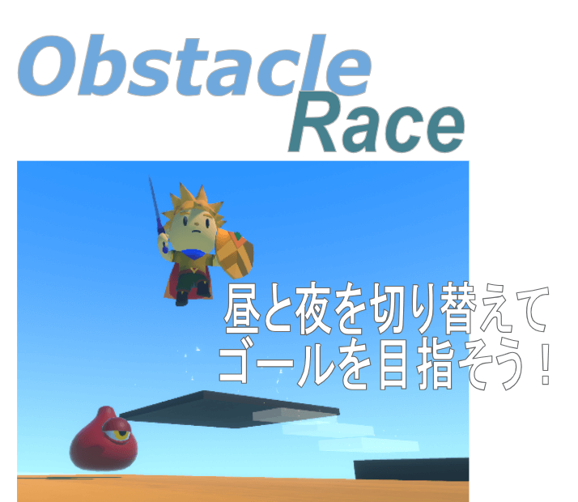
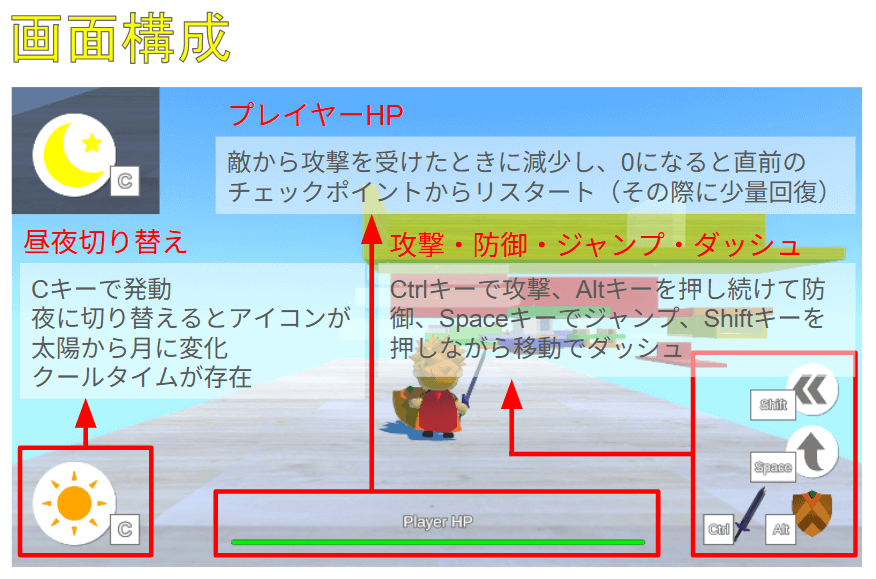
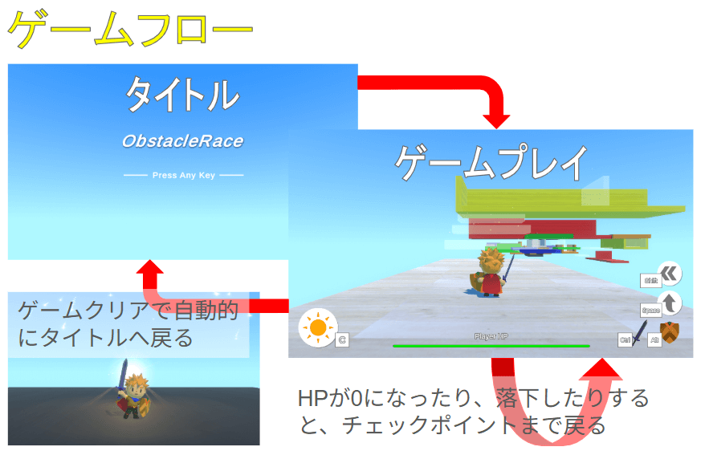
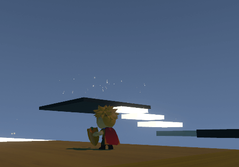

# ObstacleRace
**WebGL：[https://31f3dz.github.io/portfolio/ObstacleRace/](https://31f3dz.github.io/portfolio/ObstacleRace/)**



昼と夜を切り替えながら、敵キャラクターや動く足場といった障害物を乗り越えていく3Dアクションゲーム。
夜になると敵が強くなったり、新たな障害物が現れたりしますが、それを上手く回避・利用しながらゴールを目指しましょう！
昼夜の切り替えはワンボタン、プレイヤーは攻撃・防御・ジャンプ・ダッシュのシンプルな操作で、アクション中にタイミングよく昼夜を切り替えることが攻略のカギとなります。

## 使用したツールなど
* Unity (ver.2022.3.62f1)
* Visual Studio
* 利用したアセット
1. RPG Tiny Hero Duo PBR Polyart
2. RPG Monster Duo PBR Polyart
3. Cartoon FX Remaster Free
4. Customizable skybox
5. 15 Original Wood Texture
6. Simple UI Elements
7. AI Navigation
8. Cinemachine
9. Post Processing
10. Unity Recorder
* 画像編集ツール

(プレイヤーキャラクターとステージマテリアル、各種エフェクトについて)
積み木でできたステージを人形のキャラクターが駆け回ることをイメージして、ステージマテリアルは木目調に、キャラクターと各種エフェクトはカートゥーン調になるものを選びました。

(Post Processingによる発光感の調整)
夜に切り替えたとき、発光設定したマテリアルがより鮮やかに光って見えるよう、Post ProcessingのBloomエフェクトを使って調整しました。

(Unity Recorderと画像編集ツール)
Unity上で背景透過のオブジェクト画像ファイルを作成し、別途編集ツールでサイズ等の調整を行いました。

## 制作に当たって
3Dゲームの基本的なアクション要素を盛り込みつつ、カートゥーン調に統一されたオブジェクト、昼夜の切り替えによる環境の変化といった見た目にも鮮やかで、パズル的なギミックも楽しめるゲームを考案しました。
* 障害物を上手く乗り越えるための自由なカメラ操作
* 攻撃や防御、ジャンプといったお馴染みのアクション
* 発光感や攻撃命中を演出するために複数のエフェクトを活用
* 鮮やかに光るブロックと不気味に光る敵とで夜の特別感を演出
* 動く足場や夜にだけ現れる障害物を組み合わせたパズル要素
* どのキーがどの操作に対応しているのか一目で分かるUI

## ゲーム企画
  
  
  

## 作品のポイント
### 昼と夜を切り替えながらゴールを目指すパズルアクション
  
昼のときは半透明ですり抜けられたブロックも、夜になると実体化して障害物ないしは足場へと変わります。ブロックは自作のパーティクルシステムと、Post ProcessingのBloomエフェクトを使い、夜になったときの発光感を高めています。これらのブロックをときには足場として使ったり、ときには障害物として回避したりと、昼夜を適時切り替えながらゴールへと進むパズルアクションに仕上げました。

### 3Dアクションゲームにお馴染みのシンプルな操作
  
基本的なアクションは攻撃・防御・ジャンプ・ダッシュといった、お馴染みで理解しやすい操作のみ。ダッシュとジャンプを組み合わせることで足場へ飛び移る際の飛距離を稼いだり、防御で盾を構えた際にはプレイヤーの向きを変えずに前後左右の移動が可能になるため敵と戦いやすくなったりします。なお、敵キャラクターは通常決められた場所を巡回していますが、プレイヤーを見つけると一定の範囲内で追跡してきます。

EnemyAI.csの抜粋
```C#
[SerializeField] float detectionRange = 10.0f;
[SerializeField] float patrolRadius = 5.0f;
[SerializeField] float patrolInterval = 3.0f;

void Update()
{
    float distance = Vector3.Distance(target.transform.position, transform.position); // 敵キャラクターとプレイヤーとの距離

    Vector3 direction = target.transform.position - transform.position;
    Quaternion targetRotation = Quaternion.LookRotation(direction);
    float rotationSpeed = 600 * Time.deltaTime;

    // NavMeshAgentの停止範囲内に入ったらプレイヤーの方を向いて、場合によっては攻撃
    if (distance <= agent.stoppingDistance)
    {
        transform.rotation = Quaternion.RotateTowards(transform.rotation, targetRotation, rotationSpeed);

        if (!isAttack) StartCoroutine(IsAttack());
    }

    // プレイヤーが探知範囲内なら追跡モード、範囲外なら巡回モードへ移行
    if (distance <= detectionRange) currentState = State.chase;
    else currentState = State.patrol;

    if (currentState == State.patrol) Patrol();
    else if (currentState == State.chase) Chase();
}

// 巡回モードなら一定の時間ごとにランダムな場所を目標地点として移動
void Patrol()
{
    patrolTimer += Time.deltaTime;

    if (patrolTimer >= patrolInterval)
    {
        Vector3 randomPos = RandomNavMeshLocation(patrolRadius);
        agent.SetDestination(randomPos);
        patrolTimer = 0;
    }
}

// 追跡モードならプレイヤーを目標地点として移動
void Chase()
{
    agent.SetDestination(target.transform.position);
}

// ランダムな場所から移動可能なNavMesh上の地点を取得
Vector3 RandomNavMeshLocation(float radius)
{
    Vector3 randomDirection = Random.insideUnitSphere * radius + startPosition;

    if (NavMesh.SamplePosition(randomDirection, out NavMeshHit hit, radius, NavMesh.AllAreas))
    {
        return hit.position;
    }

    return transform.position;
}
```

### Cinemachineを使った自由なカメラ操作
  
先を見据えて足場を乗り継いでいくことが攻略の要となるため、自身で自由に操作できるカメラは欠かせません。CinemachineのVirtual Cameraを使って、プレイヤーに追従しつつ、周囲の環境を広く見渡すことができ、マウス操作も可能な3人称視点のカメラワークを実装しました。また、プレイヤーの移動方向がカメラの向いている方向に一致するよう、移動ベクトルをカメラに合わせて回転させています。

### トライアンドエラーに向いたチェックポイント機能
  
足場へ飛び移れずに落下したり、敵からの攻撃を受けてHPが0になったりするとその時点でゲームオーバーですが、チェックポイントからすぐにゲームを再開できます。チェックポイントはステージの要所に存在し、そこを通過すると画面上にメッセージが表示され分かりやすくなっています。ゲームオーバーにも特にデメリットはないため、チェックポイントを1つずつ着実に通過しながらトライアンドエラーを楽しめます。

### タイトル画面でゲーム性を表現
  
タイトル画面でいずれかのキーを押すとステージ画面へ進みますが、何もせずに放置していると昼と夜が少しずつ移り変わるようにしました。Directional Lightを回転させたり、昼と夜のSkyboxを線形補間させたりして、お遊び要素ながらもゲーム性を簡単に伝えられるよう工夫しました。

EnemyAI.csの抜粋
```C#
[SerializeField] Light directionalLight;

[SerializeField] Material daySkybox; // 昼用の.mat
[SerializeField] Material nightSkybox; // 夜用の.mat

[Range(0f, 1f)]
[SerializeField] float blend = 0f; // 0=昼, 1=夜

void Update()
{
    directionalLight.transform.Rotate(new Vector3(-18, 0, 0) * Time.deltaTime);

    // blend を時間で変化させる
    blend = Mathf.PingPong(Time.time * 0.05f, 1f);

    // 2つのマテリアルを補間
    RenderSettings.skybox.Lerp(daySkybox, nightSkybox, blend);
}
```

## 今後の制作
* プレイヤーとカメラの間に障害物が入ったときの見え方を改善する
* 鍵アイテムやスイッチで開く扉などを実装してパズル要素を高める
* 夜限定の障害物にバリエーションを持たせる（トゲ、火炎放射等）
* 攻撃時に斬撃エフェクトを出したり、連続攻撃でモーションが変わったりするなど、アクションの見栄えをよくする
* 夜に敵が強化されたことをより実感できるようにする（攻撃方法の追加等）
* オブジェクトの形にバリエーションを持たせて、積み木でできたステージであることを強調する
